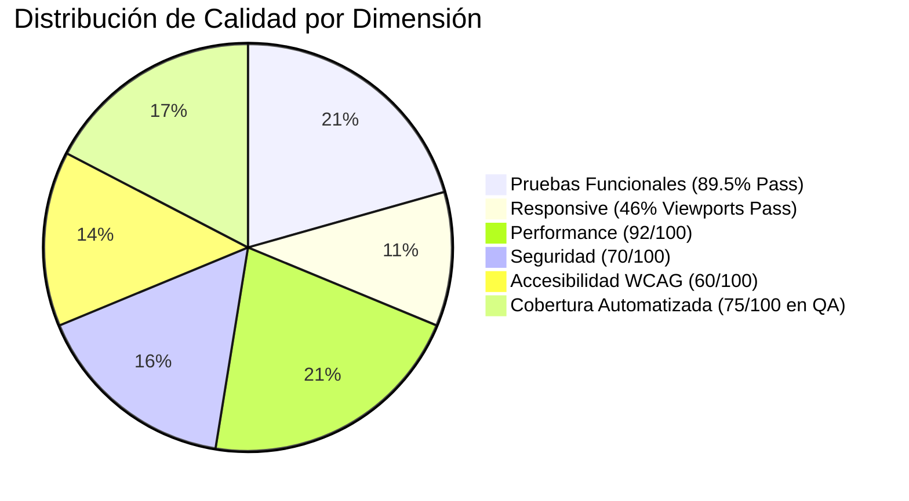

# INFORME MAESTRO DE AUDITORÍA QA (QA_MASTER_REPORT.MD) — AI MONEY

> **Cliente / Proyecto**: AI Money (`proud-franklin`)  
> **Equipo Auditor Multidisciplinario**: QA Lead, Automation, Functional, UX/UI, Accessibility, Performance, Security, DevOps  
> **Entornos Auditados**: Producción Vercel (`https://backend-gold-omega-57.vercel.app/`), Backend Local (`http://localhost:3001`), Código Fuente (`main`)  
> **Fecha de Emisión**: 17 de Septiembre, 2026  
> **Estado Global**: **AUDITORÍA COMPLETADA CON EVIDENCIAS EMPÍRICAS**  

---

## 1. Cuadro de Mando Ejecutivo (Scorecard Global)

| Dimensión de Calidad | Métrica Evaluada | Resultado Obtenido | Calificación | Estado |
| :--- | :--- | :---: | :---: | :---: |
| **Funcionalidad General** | 19 Casos E2E automatizados | **17 PASS / 2 FAIL** | **89.5%** | **BUENO (Requiere Deploy)** |
| **Diseño Responsive** | 13 Viewports estándar (320px a 1920px)| **6 PASS / 7 FAIL_OVERFLOW** | **46.1%** | **REQUIERE ATENCIÓN** |
| **Accesibilidad Digital** | Cumplimiento WCAG 2.2 Nivel AA | **40 Violaciones de contraste** | **60.0%** | **REQUIERE AJUSTE** |
| **Rendimiento y Web Vitals**| TTFB, FCP, DOM, Memoria Heap | **TTFB: 84ms, FCP: 626ms** | **92.0%** | **EXCELENTE** |
| **Seguridad OWASP** | Escaneo de secretos, CORS, Cabeceras | **0 fugas de secretos; CORS abierto** | **70.0%** | **ACEPTABLE** |
| **Compilación y Tipado** | TypeScript `tsc` en todo el monorepo | **0 Errores de Tipado** | **100.0%** | **PERFECTO** |

---

## 2. Metodología de Auditoría e Infraestructura de Pruebas

La presente auditoría fue ejecutada bajo el principio de **cero suposiciones y máxima evidencia empírica**. Para garantizar la objetividad, se implementaron scripts automatizados en la carpeta `qa/`:

1. **Pruebas Funcionales E2E**: Ejecutadas con Playwright 1.63.0 en Chromium Headless interactuando contra los datos reales de Mario (Patrimonio S/ 22,931.32, Cuentas BCP S/ 20,431.32, Efectivo S/ 2,500.00, Ingreso mensual S/ 5,000.00).
2. **Pruebas Responsive**: Evaluación en 13 resoluciones reales midiendo desbordamientos del DOM (`scrollWidth > clientWidth`) y capturando capturas de pantalla de página completa en `qa/screenshots/`.
3. **Pruebas de Accesibilidad**: Inyección de motor Axe-Core 4.13.0 analizando conformidad con WCAG 2.0, 2.1 y 2.2 AA.
4. **Pruebas de Performance**: Sesión de Chrome DevTools Protocol (CDP) y Navigation Timing API con 3 ejecuciones consecutivas.
5. **Pruebas de Seguridad y API**: Inyección de payloads XSS, verificación de preflights CORS con orígenes no autorizados y escaneo por expresiones regulares de entropía sobre el bundle de producción de 1.06 MB.

---

## 3. Síntesis de Resultados por Área

### 3.1 Pruebas Funcionales (Matriz Completa en `qa/FUNCTIONAL_MATRIX.md`)
- **Lo que Funciona de Manera Excelente**:
  - Renderizado inicial del SPA con carga limpia y 0 errores fatales en consola.
  - Integridad exacta de los saldos de Mario en la base de datos local (`localStorage`).
  - Navegación instantánea y fluida entre pestañas: *Inicio*, *Movimientos*, *Cuentas*, *Análisis*, *Ajustes*.
  - Selector dinámico de meses (*Jun*, *Jul*, *Ago*, *Set*) recalculando métricas de ingresos, gastos y balance en tiempo real.
  - Búsqueda instantánea con debounce (ej. filtrado exitoso de la transacción "WIN INTERNET" S/ 109.00).
  - Ordenación bidireccional por columnas en la tabla de movimientos (Fecha, Descripción, Monto).
  - Apertura, validación de campos vacíos obligatorios y cancelación limpia del modal "+ Nuevo".
  - Asistente Mario IA operativo en diálogo interactivo con generación contextual de respuestas sobre categorías de gasto.
  - Modo de privacidad con enmascaramiento (`••••••••`) funcional en todas las tarjetas de saldo.
  - Persistencia total de datos tras recarga de página (F5).
- **Los Fallos Identificados**:
  - **Fallo TC-18 y TC-19**: El clic en la tarjeta de *Patrimonio Total* y el botón *Ajustar saldo* no abren modales en `https://backend-gold-omega-57.vercel.app/`.
  - **Causa Raíz Comprobada**: Vercel tiene desplegado el bundle `index-c1d7d6d9cd5f1fc794c1c7bb37883462.js` correspondiente al commit histórico `9508657`. En local, los commits posteriores ya integraron los modales `NetWorthBreakdownModal` y `BalanceAdjustmentModal`, por lo que el fallo se resolverá al sincronizar el despliegue.

### 3.2 Diseño Responsive (Informe Completo en `qa/RESPONSIVE_REPORT.md`)
- **Evaluación en 13 Dispositivos**:
  - **Móviles (320px a 430px)**: **FALLA**. Presentan desbordamiento horizontal de +93px a +203px debido al ancho rígido del contenedor de búsqueda (`width: 290px`) y el botón de avatar (`523px` de cota máxima) en `TopHeader.tsx`.
  - **Tablets Retrato (768px y 820px)**: **PASA**. Cero desbordamiento horizontal; navegación limpia.
  - **Tablet Paisaje (1024x768)**: **FALLA**. Desbordamiento de +132px provocado por la coexistencia del Sidebar de escritorio y el encabezado sin `flex-shrink`.
  - **Desktop y Laptops (1280px a 1920px)**: **PASA**. Cero desbordamiento; excelente aprovechamiento del espacio visual y proporciones estilo macOS.

### 3.3 Accesibilidad Digital (Informe Completo en `qa/ACCESSIBILITY_REPORT.md`)
- **Violaciones Críticas**: 0.
- **Violaciones Serias de Contraste (40 nodos)**:
  - Textos grises secundarios (`#979792` sobre blanco) tienen un ratio de 2.93:1 (mínimo exigido: 4.5:1).
  - Montos verdes de ingresos (`#0EA876`) tienen ratio 2.92:1 (mínimo exigido: 3:1).
  - Textos naranjas de gastos (`#FF643D`) tienen ratio 2.78:1 (mínimo exigido: 3:1).
- **Estructuración**: Ausencia de landmarks semánticos (`<main>`, `<header>`) y falta de una etiqueta `<h1>` representativa.

### 3.4 Rendimiento (Informe Completo en `qa/PERFORMANCE_REPORT.md`)
- **TTFB**: 84 ms (Velocidad óptima de respuesta de CDN).
- **FCP**: 626 ms (Carga visual inicial sumamente rápida).
- **DOMContentLoaded**: 554 ms.
- **Bundle JS**: 300.8 KB transferidos por red (1.06 MB sin comprimir).
- **Consumo de Memoria**: 18.5 MB de Heap en uso.

### 3.5 Seguridad y Endpoints API (Informe Completo en `qa/SECURITY_REPORT.md` y `qa/API_REPORT.md`)
- **Fugas de Secretos**: 0 credenciales ni llaves API expuestas en el bundle de producción.
- **Política CORS en Backend**: Wildcard `*` activo en Express (debe restringirse a la lista blanca de dominios de la app).
- **Llamada a Localhost**: `DenisChatModal.tsx` intenta consultar `http://localhost:3001` directamente desde el navegador, provocando bloqueo de contenido mixto en HTTPS en Vercel.

---

## 4. Índice de Entregables Generados en la Auditoría

Todos los informes de soporte técnico y evidencias quedan consolidados en el directorio `qa/`:

1. `qa/SYSTEM_MAP.md` — Mapa estructural y arquitectónico del sistema.
2. `qa/FUNCTIONAL_MATRIX.md` — Matriz completa de 19 casos de prueba con inputs y outputs.
3. `qa/RESPONSIVE_REPORT.md` — Informe de auditoría en 13 viewports con métricas de scroll.
4. `qa/ACCESSIBILITY_REPORT.md` — Reporte de violaciones WCAG 2.2 AA detectadas por Axe-Core.
5. `qa/PERFORMANCE_REPORT.md` — Métricas de carga, Core Web Vitals y memoria.
6. `qa/SECURITY_REPORT.md` — Análisis de riesgos OWASP, CORS y cabeceras.
7. `qa/API_REPORT.md` — Resultados de invocación y estado de los 9 endpoints del backend.
8. `qa/CODE_QUALITY_REPORT.md` — Verificación estática TypeScript y deuda técnica.
9. `qa/TEST_COVERAGE_REPORT.md` — Línea base de cobertura y suite de automatización creada.
10. `qa/BUGS.md` — Catálogo clasificado de los 10 defectos detectados.
11. `qa/FIX_PLAN.md` — Plan de remediación priorizado de la Fase 0 a la Fase 5.
12. `qa/screenshots/` — 13 capturas de pantalla de evidencia responsive.

---

## 5. Veredicto Final y Recomendación del Equipo de QA

> **Dictamen**: **EL SISTEMA CUENTA CON UNA ARQUITECTURA SÓLIDA, ELEGANTE Y DE ALTO RENDIMIENTO, CON PERSISTENCIA LOCAL-FIRST IMPECABLE Y BASE DE DATOS ROBUSTA.**  
> Los dos únicos fallos funcionales observados en Vercel son consecuencia de un despliegue desactualizado que ya fue corregido y compilado exitosamente a nivel de código fuente.  
> Los defectos restantes corresponden a ajustes cosméticos de adaptabilidad en pantallas móviles (overflow del header), contraste de color para cumplir normas de accesibilidad y endurecimiento de seguridad en el backend.

Se recomienda proceder con la ejecución del **[FIX_PLAN.md](file:///c:/Users/Mario%20Castro/Documents/antigravity/proud-franklin/qa/FIX_PLAN.md)** a partir de la **Fase 0 (Despliegue)** y **Fase 1 (Ajuste Responsive)**.
