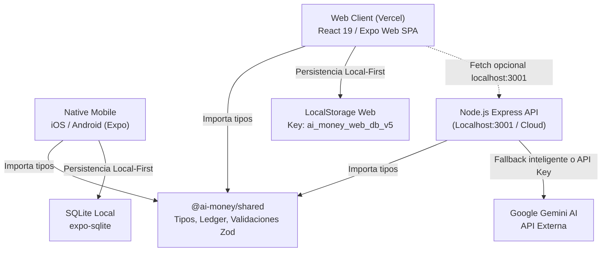

# MAPA COMPLETO DEL SISTEMA — AI MONEY (PROUD-FRANKLIN)

> **Auditoría QA Multidisciplinaria**  
> **Fecha**: 17 de Septiembre, 2026  
> **Repositorio**: `https://github.com/mcorname/gastosapp`  
> **URL de Producción Auditada**: `https://backend-gold-omega-57.vercel.app/`  
> **Backend Local**: `http://localhost:3001`  

---

## 1. Arquitectura General y Topología

AI Money está estructurado como un monorepo TypeScript gestionado con npm workspaces, compuesto por tres capas principales:

---

## 2. Inventario de Componentes y Vistas

### 2.1 Módulos Frontend (`apps/mobile/src`)

| Componente | Tipo | Función Principal | Estado de Integración |
| :--- | :--- | :--- | :--- |
| `App.tsx` | Contenedor Raíz | Inicialización de base de datos, tema macOS Light, carga de fuentes, enrutamiento por tabs | Activo y Operativo |
| `components/Sidebar.tsx` | Navegación Desktop | Barra lateral izquierda colapsable con accesos: Inicio, Movimientos, Cuentas, Análisis, Ajustes, selector de mes y saldo rápido | Activo en Desktop |
| `components/TopHeader.tsx` | Encabezado | Barra superior con barra de búsqueda rápida, botón de privacidad (`••••••••`), avatar de usuario y atajo a Mario IA | Activo (Presenta overflow en móviles) |
| `components/BottomNav.tsx` | Navegación Móvil | Barra inferior fija con iconos para navegación táctil en pantallas < 768px | Activo en Móviles |
| `components/SummaryCard.tsx` | Métrica Principal | Tarjeta interactiva de Patrimonio Total, desglose de activos e incremento mensual | Activo (Trigger modal desincronizado en Vercel) |
| `components/StatCards.tsx` | Tarjetas de Flujo | Indicadores de Ingresos del Mes, Gastos del Mes y Balance Neto | Activo |
| `components/TransactionsList.tsx` | Lista / Tabla | Listado de movimientos con soporte para ordenación por fecha/monto, paginación, filtros de categoría y búsqueda | Activo |
| `components/MonthlyTrendChart.tsx` | Visualización | Gráfico SVG interactivo de barras y tendencias de ingresos vs gastos | Activo |
| `components/AccountsView.tsx` | Gestión Bancaria | Listado y administración de cuentas (BCP, Efectivo, Ahorros), saldos y botón de ajuste de saldo | Activo |
| `components/NewTransactionModal.tsx` | Modal / Formulario | Registro de ingresos y gastos con selección de fecha, cuenta, categoría, notas y validación | Activo |
| `components/DenisChatModal.tsx` | Asistente IA | Diálogo conversacional financiero con soporte contextual de ingresos, gastos y categorías | Activo (Hardcodea `localhost:3001`) |
| `components/NetWorthBreakdownModal.tsx` | Modal Analítico | Desglose detallado de activos por cuenta e institución financiera | Presente en código / Desincronizado en Vercel |
| `components/BalanceAdjustmentModal.tsx` | Modal de Ajuste | Cuadre de caja y ajuste directo de saldos en cuentas | Presente en código / Desincronizado en Vercel |

### 2.2 Motor de Base de Datos Local-First

- **Entorno Web (`apps/mobile/src/db/database.web.ts`)**:
  - Emulador en memoria compatible con la interfaz síncrona de SQLite (`runSync`, `getAllSync`, `execSync`).
  - Clave de persistencia: `ai_money_web_db_v5`.
  - Migración y semilla automática de datos históricos (Mario: BCP S/ 20,431.32, Efectivo S/ 2,500.00, Sueldo S/ 5,000.00, Gastos WIN/Alquiler).
- **Entorno Nativo (`apps/mobile/src/db/database.ts`)**:
  - Motor real `expo-sqlite` con tablas relacionales: `accounts`, `categories`, `transactions`, `budgets`.

### 2.3 Servicios Backend (`apps/backend/src`)

| Endpoint | Método | Estado | Lógica y Comportamiento |
| :--- | :--- | :--- | :--- |
| `/health` | GET | **200 OK** | Monitor de salud del servicio, retorna timestamp y nombre del servicio |
| `/api/ai/extract-text` | POST | **200 OK** | Parseo de texto natural en lenguaje financiero con validación Zod. Fallback local si no hay API Key de Gemini |
| `/api/ai/chat-denis` | POST | **200 OK** | Asistente conversacional financiero con contexto de balance, ingresos, gastos y top categorías |
| `/api/ai/extract-receipt` | POST | **503 Unavailable** | Stub documentado ("La lectura de recibos no está disponible") |
| `/api/whatsapp/*` | ANY | **503 Unavailable** | Stub de integración WhatsApp/Twilio deshabilitado deliberadamente |
| `/api/sync/*` | ANY | **501 Not Implemented**| Stub de sincronización en la nube (Arquitectura Local-First) |
| `/api/shortcuts/*` | ANY | **503 Unavailable** | Stub de atajos iOS/SMS |

---

## 3. Matriz de Dependencias y Versiones

- **React**: `19.2.3`
- **React Native**: `0.86.3`
- **Expo SDK**: `57.0.20`
- **TypeScript**: `5.5.4`
- **Playwright**: `1.63.0`
- **Axe-Core**: `4.13.0`
- **Express**: `4.22.2` (con vulnerabilidad moderada reportada en `qs`)
